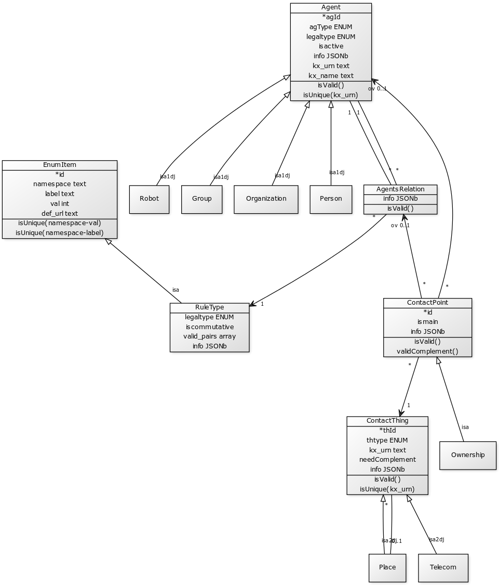

A complete "social kernel" database and back-end, to be implemented with with relational-JSON persistence (with [PostgreSQL 9.6+](https://www.postgresql.org/docs/current/static/functions-json.html)) and some "Agile Framework" (as Django, Spring, CakePHP, etc.); based on **[socKer-simple](https://github.com/ppKrauss/socKer-simple)**.

-----

It is a model to be used as core at any  [CRM](https://en.wikipedia.org/wiki/Customer_relationship_management)-like system... With precise information and a [RDF semantic](https://en.wikipedia.org/wiki/Resource_Description_Framework). The basic entities are defined in [SchemaOrg](https://schema.org/):

* **_Agent_**: a generalization of [sc:Person](https://schema.org/Person), [sc:Organization](https://schema.org/Organization), [foaf:Group](http://xmlns.com/foaf/spec/#term_Group), and others, as  [foaf:Agent](http://xmlns.com/foaf/spec/#term_Agent) definition.  The specializations (eg. Person) can be implicit in a attribute, or explicit when implementing some relevant relation in the system.  

* **_ContactThing_**: a generic [sc:Thing](https://schema.org/Thing) that can be a [sc:Place](https://schema.org/Place) (its [sc:PostalAddress](https://schema.org/PostalAddress)), a [wd:telecommunication](https://www.wikidata.org/wiki/Q418) device (its eletronic address like telephone number or e-mail string), or other. All _ContactThing_ have an standard address (an [wd:URI](https://www.wikidata.org/wiki/Q61694))  and (optional to informe) an [wd:owner](https://www.wikidata.org/wiki/Q16869121).

* **_ContactPoint_**: a [sc:ContactPoint](https://schema.org/ContactPoint), linking _Agent_ with _ContactThing_.

* **_AgentsRelation_**: an *Agent-Agent* relationship, to hold stable and usual metadata about any kind of relations (Person-Organization, Person-Person, etc.).

The main enhances about previous didactic [socKer-simple](https://github.com/ppKrauss/socKer-simple)  are:

* generalization of _ContactPoint_, for postal adress and others.
* add agent-agent relationships (_AgentsRelation_) that enhance the informations of the catalogue.
* add secondary relations: _AgentsRelation_'s _ContanctPoint_ for special cases (eg. [foaf:workplaceHomepage](http://xmlns.com/foaf/spec/#term_workplaceHomepage) as a _TelecomPoint_ of a Person-Organization relation); Place-ContactPoint relations as [ch:areaServed](https://schema.org/areaServed) (or [sc:validIn](https://schema.org/validIn), [sc:geographicArea](https://schema.org/geographicArea), etc.), extended for Place-Place relations (eg. [sc:containedInPlace](https://schema.org/containedInPlace)).

## THE MODEL

LEGEND: _isa_ and _ispart_ in class-inheritances denotes "is a" and "is part of" forms. A digit after it, as "isa2", is a label for group the children. The indications "dj" and "ov" in a group, as "isa1dj", indicates that children are disjoint and overlaped sets, respectively. Similarly "of" in cardinality is a label for "participation group", and can be "of1", "of2", "of1dj", "of1ov", etc.

See [build1.sql](src/build1.sql)

### Inheritances and ENUMs

With the flexible approach used in the project, the class/subclass relations can be modeled by structure or simply by a [enumerated type](https://en.wikipedia.org/wiki/Enumerated_type) choice (ENUM). The structure and validation of JSON can be performed in runtime, only indicating the ENUM type.

Some examples will be described as illustration. The complete list of definitions are in [this spreadsheet](https://docs.google.com/spreadsheets/d/1A_BcfWxYwn-eDLegI4odx6X1Mo5_XIMZ4OcYn7LDmaw/), relesead as [enum.csv](data/enum.csv), and transformed automatically into a table (`enum_item`), in the SQL initialization.

Agent (agtype)| Agent (legaltype) | thype/Telecom | thype/Places
------------- | ----------------- | ------------- | --------------
1. _Organization_ is a [wd:Organization](https://www.wikidata.org/wiki/Q43229)  2. _Person_ is a [sc:Person](https://schema.org/Person)  3. _Group_ is a [foaf:Group](http://xmlns.com/foaf/spec/#term_Group)  4. _Robot_ is a [wd:SoftwareAgent](https://www.wikidata.org/wiki/Q2297769)   |   1. [sc:Corporation](https://schema.org/Corporation),    2. [sc:GovernmentOrganization](https://schema.org/GovernmentOrganization)  3. [sc:NGO](https://schema.org/NGO)   4. ...     |  100. [sc:telephone](https://schema.org/telephone)  102. [sc:email](https://schema.org/email)  104. [wd:HomePage](https://www.wikidata.org/wiki/Q11439)  ... | 10. [sc:Country](http://schema.org/Country)  12. [sc:City](http://schema.org/City)  14. [sc:PostalAddress](http://schema.org/PostalAddress) ...

Note: the [sc:Organization](https://schema.org/Organization) is equivalent to [wd:SocialGroup](https://www.wikidata.org/wiki/Q874405), not  *wd:Organization*. So take care wih it and all its chieldren (see thematic variants), that have semantic intersections with Group variants.

### Agent-Agent relationships
Modeled as _AgentsRelation_ class:

Relation type | *rule* examples (of SchemaOrg)
------------ | -------------
Organization-Organization      | [subOrganization](https://schema.org/subOrganization), [LocalBusiness](https://schema.org/LocalBusiness), [sponsor](https://schema.org/sponsor), ... some [OrganizationRoleType](http://gs1.org/voc/OrganizationRoleType)s, ...
Organization-Person   | [founder](https://schema.org/founder), [employee](https://schema.org/employee), [sponsor](https://schema.org/sponsor), [affiliation](https://schema.org/affiliation), , ... some [OrganizationRoleType](http://gs1.org/voc/OrganizationRoleType)s, ...
Person-Person | [children](https://schema.org/children), ...
Agent-Agent | [follows](https://schema.org/follows), ...

## OBJECTIVE

To develop a simple framework for

 * Use and expand the scope of the [VCard standard](https://en.wikipedia.org/wiki/VCard), to manage contacts and its relationships in a database, with [SQL](https://www.wikidata.org/wiki/Q47607) and [SPARQL](https://www.wikidata.org/wiki/Q54871) queries.

 * Store stable and curated data: [digital preservation](https://en.wikipedia.org/wiki/Digital_preservation) of original data (like [LOCKSS](https://en.wikipedia.org/wiki/LOCKSS)) and subsequent data processing (like *git commit* or [Mediawiki's page history](https://en.wikipedia.org/wiki/Help:Page_history)).

 * Complete map: adequate [object-relational mapping](https://en.wikipedia.org/wiki/Object-relational_mapping) and complete [semantic mapping](https://en.wikipedia.org/wiki/Ontology_alignment).

 * A framework for [back-end](https://en.wikipedia.org/wiki/Front_and_back_ends#Back-end_focused) and "data in bulk", not for end users.

Incrementally: both, implementing this project and adopting this model.

## Prepare and installation

See SQL prepare at [src/README.md](src/README.md).
